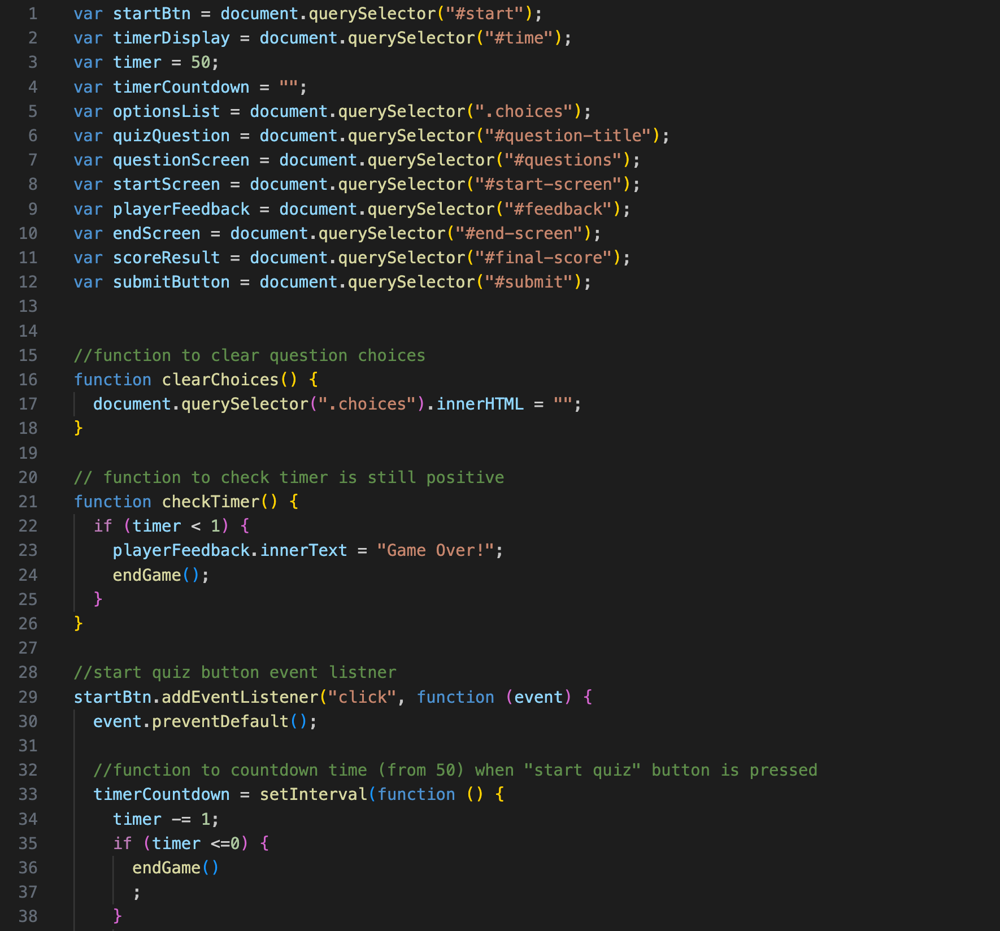
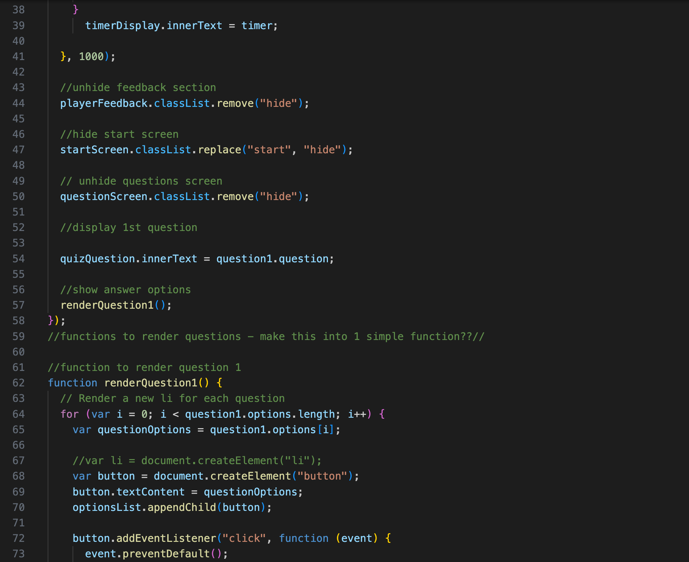
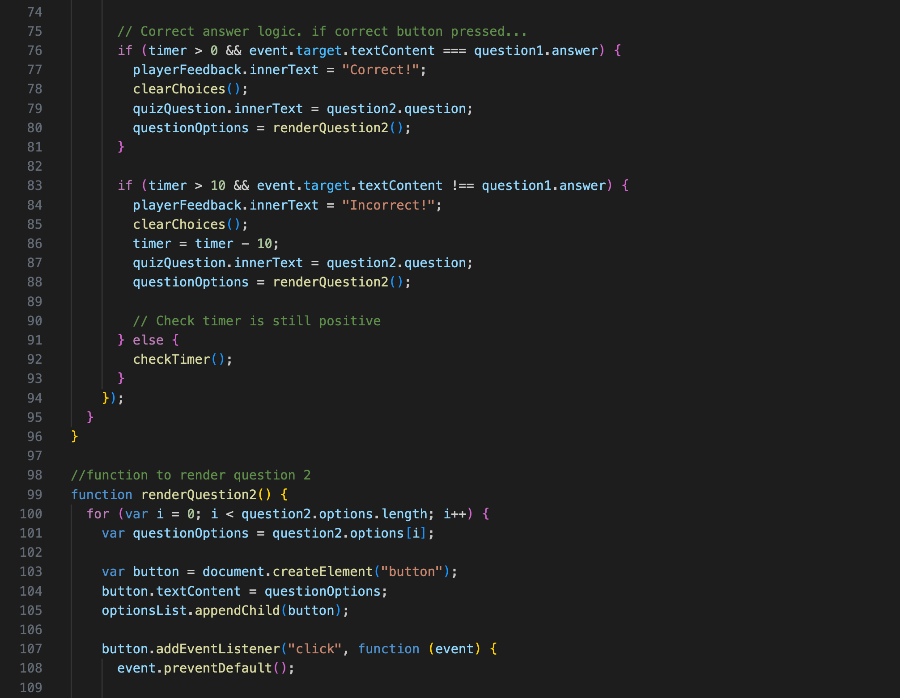
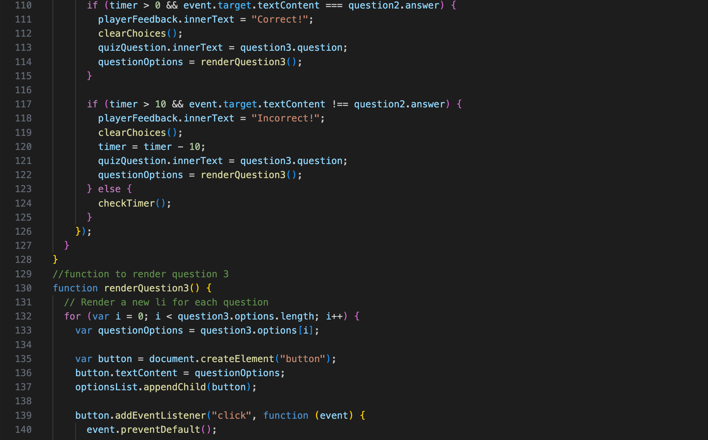
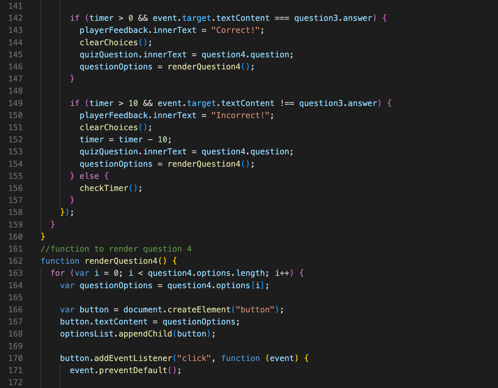
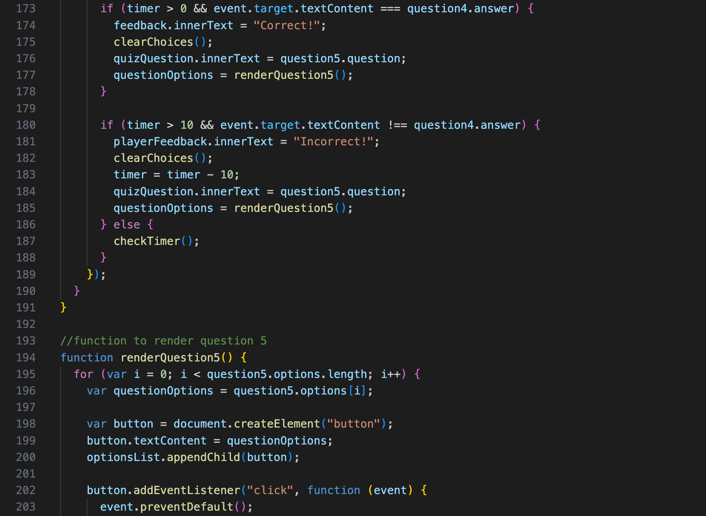
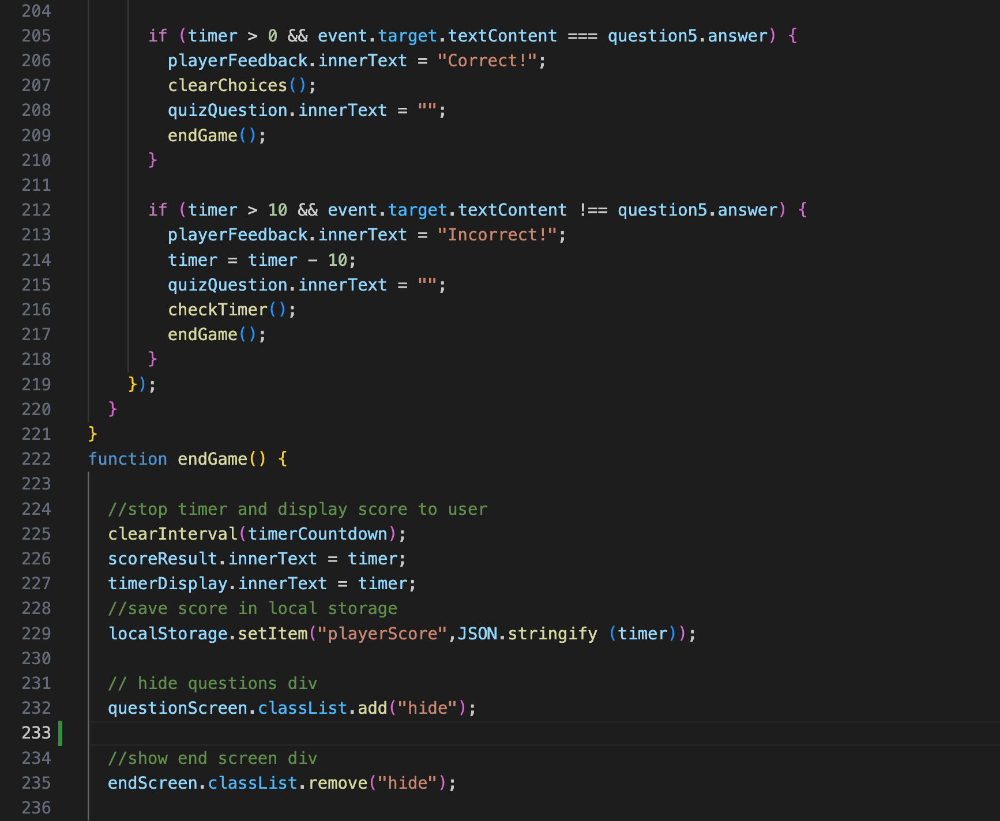
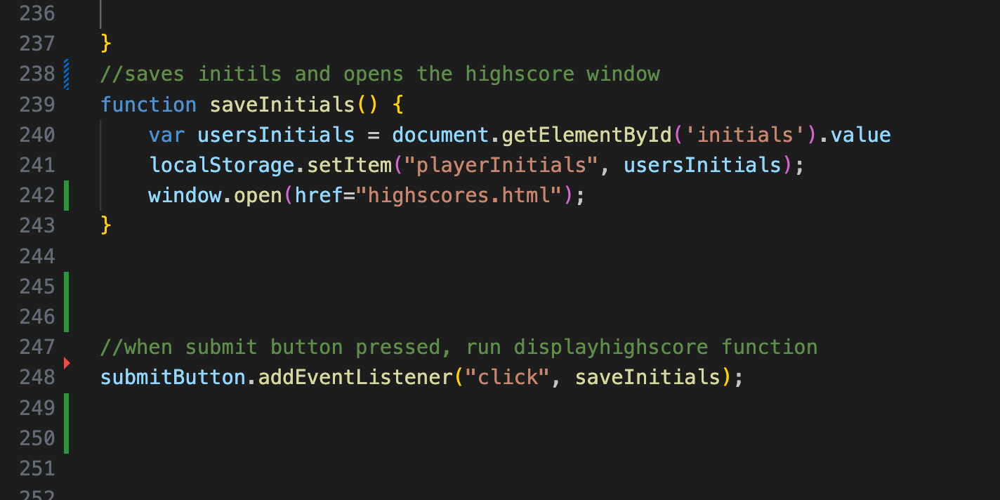
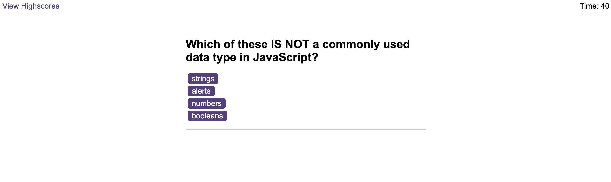

# quiz-challenge-

JavaScript code for Coding quiz

## Description

I was provided with basic HTML and CSS pages and had to add x 3 javascript files to create a coding multiple choice quiz.

Requirements:

* A start button that when clicked a timer starts and the first question appears.
 
  * Questions contain buttons for each answer.
  * 
  * When answer is clicked, the next question appears
  * 
  * If the answer clicked was incorrect then subtract time from the clock

* The quiz should end when all questions are answered or the timer reaches 0.

  * When the game ends, it should display their score and give the user the ability to save their initials and their score
  

Screenshots of code created:

Screenshot of working HTML page:

## Installation

N/A

## Usage

Click on "Start Quiz" button. Answer questions as quickly as possible, and see your score when the questions are all complete. You can also view your score in the "highscore" webpage.

Application Link:

https://adampriley1.github.io/Password-generator/

## Credits

N/A

## License
MIT License

Copyright (c) [2023] [Adam Riley]

Permission is hereby granted, free of charge, to any person obtaining a copy
of this software and associated documentation files (the "Software"), to deal
in the Software without restriction, including without limitation the rights
to use, copy, modify, merge, publish, distribute, sublicense, and/or sell
copies of the Software, and to permit persons to whom the Software is
furnished to do so, subject to the following conditions:

The above copyright notice and this permission notice shall be included in all
copies or substantial portions of the Software.

THE SOFTWARE IS PROVIDED "AS IS", WITHOUT WARRANTY OF ANY KIND, EXPRESS OR
IMPLIED, INCLUDING BUT NOT LIMITED TO THE WARRANTIES OF MERCHANTABILITY,
FITNESS FOR A PARTICULAR PURPOSE AND NONINFRINGEMENT. IN NO EVENT SHALL THE
AUTHORS OR COPYRIGHT HOLDERS BE LIABLE FOR ANY CLAIM, DAMAGES OR OTHER
LIABILITY, WHETHER IN AN ACTION OF CONTRACT, TORT OR OTHERWISE, ARISING FROM,
OUT OF OR IN CONNECTION WITH THE SOFTWARE OR THE USE OR OTHER DEALINGS IN THE
SOFTWARE.

---